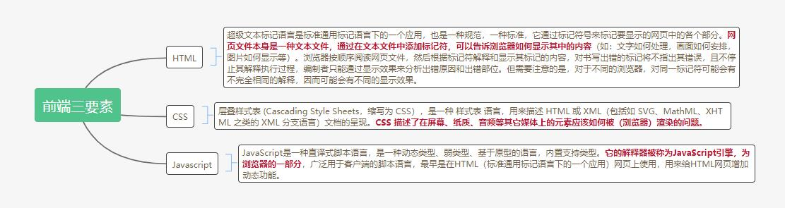
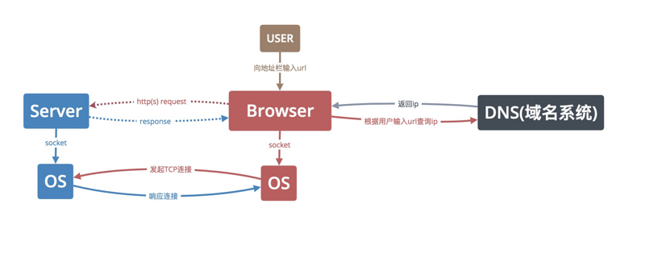

# 前端世界观系列之一-从0开始写前端
-  随着互联网时代的到来，前端作为一门新兴的技术发展了起来。

-  从最早的没有交互的静态网页，到能响应用户操作自动展示服务器数据的动态页面。

-  从每次页面更新都要等待漫长页面重载的多页应用，到局部更新页面体验优异的单页应用。

-  我们看到的是前端技术的百家争鸣的纷繁乱世，除了在争鸣中胜出的主流三大框架Angular,Vue,React，还有自诩为下一代前端框架的omi,umi。那么他们到底有什么共性与不同？

-  在这纷繁的乱世中，前端究竟是代表什么，万变不离其宗的宗又是什么

-  本次培训希望通过一个简单的页面案例讲解前端的本质。

## 概述
- 培训内容：
  
  以某个简单页面需求实现为例，讲述前端页面的本质，并介绍前端代码是以什么样的形式运行的。

- 培训对象：
  
  任何对前端感兴趣的同学，有任何语言开发基础的同学更易于理解。

- 培训目标：
  
  理解前端的本质，理解前端三大框架的定位，理解前端页面的运行方式。

## 什么是前端
[前端一分钟介绍](https://baike.baidu.com/item/%E5%89%8D%E7%AB%AF/5956545)

>我们这里一般所说的前端是指上述视频中所讲述的**前端开发**

## 前端三要素

**重点：前端三要素均由浏览器直接或间接解析**

-------------

## 页面开发实战

以机场项目某个页面为例进行讲解
熟悉项目需求

- 需求分析

<!-- 1. 如何复用组件，提高开发效率（大型系统）
1. 如何布局页面，设计组件及组件间的交互
2. 如何获取数据 -->

- 布局分析
  
- 逻辑分析

## 从Url开始的那些事

代码写好了，来聊聊如何访问我们的代码

### 下载文件
1. 根据地址栏输入的地址向DNS（Domain Name System）查询IP
2. 通过IP向服务器发起TCP连接
3. 向服务器发起请求
4. 服务器返回请求内容
5. 浏览器开始解析渲染页面并显示
6. 关闭连接

- 打开F12调试

### *浏览器解析（了解）
1. 【下载】通过HTML解析器解析HTML文档，构建一个DOM Tree，同时通过CSS解析器解析HTML中存在的CSS，构建Style Rules，两者结合形成一个Attachment。
2. 【解析】通过Attachment构造出一个呈现树（Render Tree）
3. 【绘制准备】Render Tree构建完毕，进入到布局阶段（layout/reflow），将会为每个阶段分配一个应出现在屏幕上的确切坐标。
4. 【绘制】最后将全部的节点遍历绘制出来后，一个页面就展现出来了。

## 前端开发框架，及技术的意义

- MVVM 以vue1.0示例

- css预处理器
  
  css的语法扩展，使之更好用，支持变量、函数、嵌套写法

  [在线示例网站](https://www.sassmeister.com/)

- babel
  
  把浏览器不支持的新特性语法，转化为**浏览器支持的**可以运行的**有同样效果的**旧语法

## 现代开发模式

现在前端的主流开发模式以nodejs的webpack库为核心辅助工具，选用三大框架（Angular,Vue,React）之一进行开发。
- 集成babel，css预处理,css模块化解决方案
- 集成css预处理
- 支持css模块化解决方案
- 支持开发模式代码热更新
- 支持定制化策略的代码构建
- ...

## 结论
- 万变不离其宗的宗又是什么？  
  前端技术纵使千变万化，也不会离开前端三要素。

- 前端三大框架的定位？  
  从架构角度来看，前端技术是以多种多样的方式对三要素进行封装抽象，使之更好用，提升开发效率。

- 前端页面的运行方式？
  由浏览器，从服务器静态资源服务器，请求前端页面相关资源到浏览器所在电脑内存中，然后在本地浏览器中运行